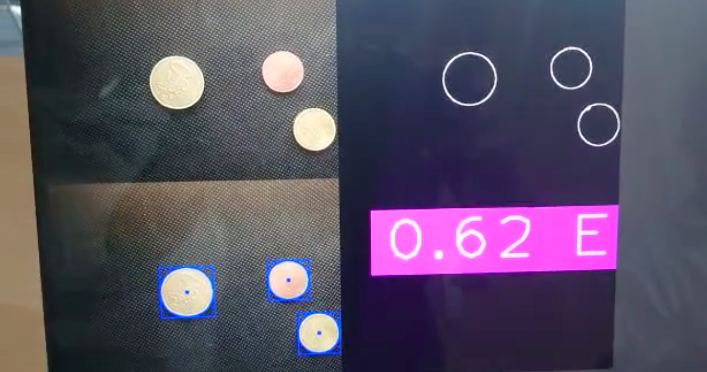

# Counting Coins Using Computer Vision with Flask

A Python project that uses **OpenCV** and **cvzone** to detect coins from a webcam, calculate their total value, and display the result on a **Flask web interface**.

---

## Practical use case

This project can be used in places like **ATM Booths** in banks or supermarket **Cashier** counters to automatically detect and count coins placed in front of a camera.

## 🔹 Features

- Detect coins using a webcam.
- Identify coin values based on size and color.
- Send the calculated total to a Flask backend.
- View the latest coin sum on a web page.
- Easy to extend for different coin types or currencies.

---

## 🛠️ Technologies Used

- Python 3.x
- OpenCV
- cvzone
- Flask
- Flask-SocketIO (optional for real-time updates)
- Flask-Sock
- NumPy
- Requests

---

## 📂 File Structure

```
├── app.py                 # Flask backend
├── coin_detector.py       # Computer vision script for detecting coins
├── templates/
│   ├── index.html         # Home page
│   └── coinCount.html     # Displays the latest coin sum
├── requirements.txt       # Python dependencies
└── README.md
```

---

## ⚙️ Installation

1. **Clone the repository**
```bash
git clone https://github.com/YourUsername/Counting-Coins-using-Computer-Vision.git
cd Counting-Coins-using-Computer-Vision
```

2. **Create a virtual environment**
```bash
python -m venv venv
source venv/bin/activate   # Linux/Mac
venv\Scripts\activate      # Windows
```

3. **Install dependencies**
```bash
pip install -r requirements.txt
```

---

## 🚀 Running the Project

1. **Start the Flask backend**
```bash
python app.py
```
- This starts the server at `http://127.0.0.1:5000`.

2. **Start the Computer Vision script**
```bash
python coin_detector.py
```
- Opens your webcam, detects coins, and sends the total coin value to the Flask server.

3. **Open your browser**
- Home page: [http://127.0.0.1:5000/](http://127.0.0.1:5000/)
- Coin count page: [http://127.0.0.1:5000/coinCount](http://127.0.0.1:5000/coinCount)

> ⚠️ Make sure the Flask server is running **before** starting the CV script.

---


## 🖼️ Screenshots



---
#### For a detailed walkthrough, please watch the [Demo Video](https://youtu.be/ds5_BQeA1nk).


---

## 🔗 Author

**Wasik** – [GitHub](https://github.com/Suprov007)

